# Insights

## 1. Insights Page Read (Redesigned Dashboard)

### Relevant Files
- `app/(app)/insights/page.tsx` — Main page; calls 3 queries (`getMyInsights`, `getKPIMetrics`, `getMarketSummary`), renders KPIStrip, MarketSnapshot, and CategorySections with region filtering.
- `app/(app)/insights/components/KPIStrip.tsx` — Responsive grid of metric stat cards with trend arrows.
- `app/(app)/insights/components/MarketSnapshot.tsx` — AI-generated summary card with market condition badge and key driver tags.
- `app/(app)/insights/components/CategorySection.tsx` — Per-category section with headline metric, data point pills, and article card grid.
- `app/(app)/insights/components/InsightCard.tsx` — Individual article card with data point pills and compact variant.
- `app/(app)/insights/components/InsightsEmptyState.tsx` — Renders no-region and no-insight outcomes.
- `convex/insights/queries.ts` — `getMyInsights` handles auth, region allow-listing, and grouped insight response shaping.
- `convex/insights/metricsQueries.ts` — `getKPIMetrics` returns national + region metrics sorted by category priority; `getMarketSummary` returns AI summary.
- `convex/insights/metrics.schema.ts` — Defines `marketMetrics` and `marketSummaries` tables and shared constants.
- `convex/users/user.schema.ts` — Defines `users` table fields (`marketRegion`, `marketRegions`).

### User Flow

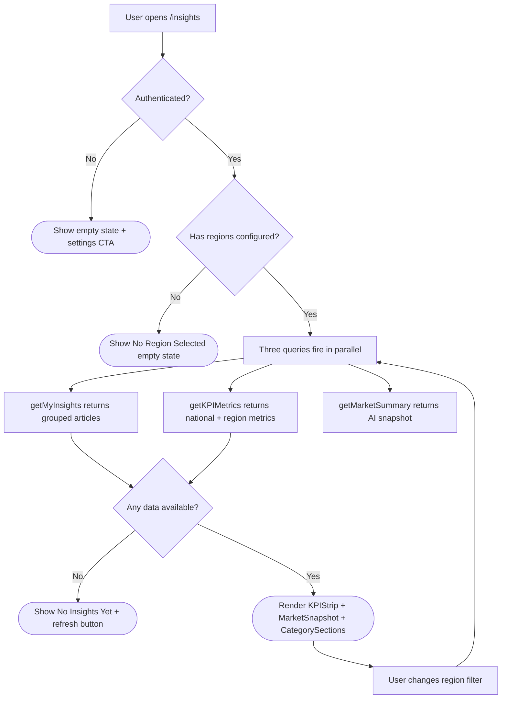

### Step Function Map

| Step | User-visible step | Related function(s) | Primary file(s) |
|---|---|---|---|
| 1 | User opens /insights | Route render, 3 `useQuery` hooks | `app/(app)/insights/page.tsx` |
| 2 | Check authentication | `ctx.auth.getUserIdentity` in each query | `convex/insights/queries.ts`, `convex/insights/metricsQueries.ts` |
| 3 | Show auth/empty state | UI-only | `InsightsEmptyState.tsx` |
| 4 | Check region configuration | `getMyInsights` user-region guards | `convex/insights/queries.ts` |
| 5 | Fetch grouped articles | `getMyInsights` | `convex/insights/queries.ts` |
| 6 | Fetch KPI metrics | `getKPIMetrics` | `convex/insights/metricsQueries.ts` |
| 7 | Fetch market summary | `getMarketSummary` | `convex/insights/metricsQueries.ts` |
| 8 | Render dashboard | KPIStrip, MarketSnapshot, CategorySection | `app/(app)/insights/components/*.tsx` |
| 9 | User changes region filter | Region filter handler re-runs queries | `app/(app)/insights/page.tsx` |

### Technical Sequence

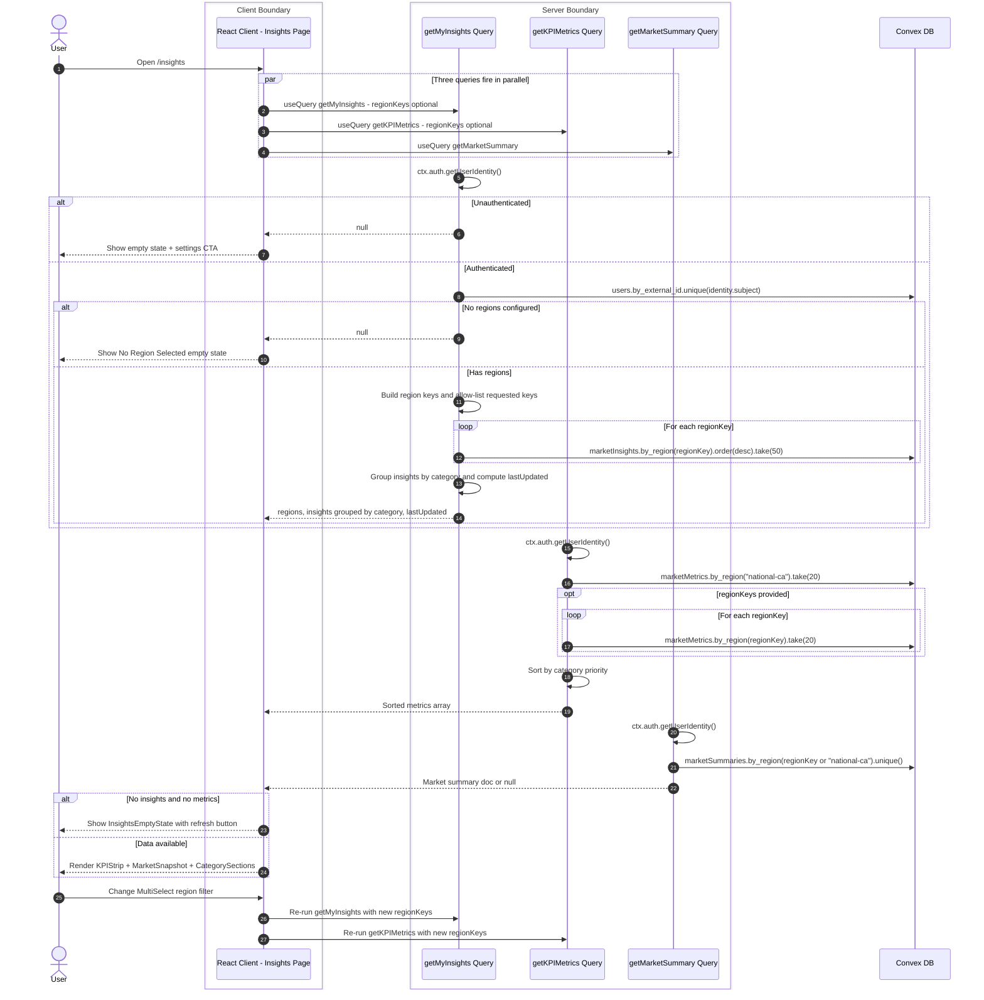

## 2. Settings Preference Writes (Regions + Interests)

### Relevant Files
- `app/(app)/settings/page.tsx` — Loads preferences and supported regions, then calls `updateRegion`/`updateInterests` on save.
- `convex/insights/queries.ts` — `getUserPreferences` and `getSupportedRegions` provide initial settings data.
- `convex/insights/sources.ts` — Supplies canonical supported region list used by `getSupportedRegions`.
- `convex/users/mutations.ts` — Authenticated mutations for persisting `marketRegions` and `marketInterests`.
- `convex/users/user.schema.ts` — Validates region and interest shapes written in user document patches.

### User Flow

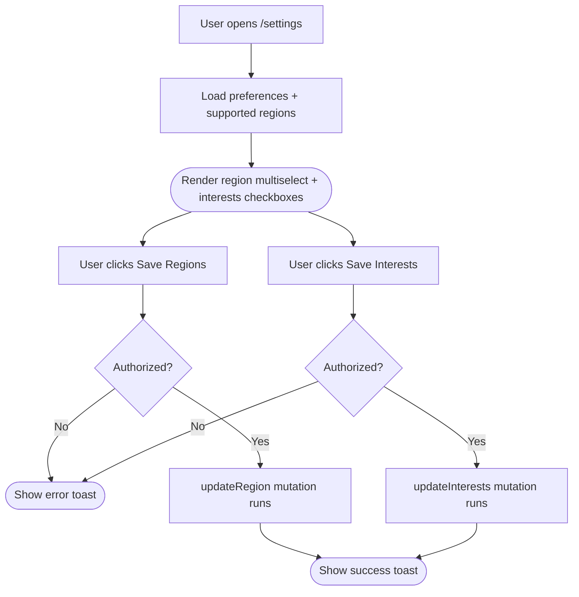

### Step Function Map

| Step | User-visible step | Related function(s) | Primary file(s) |
|---|---|---|---|
| 1 | User opens /settings | Route render | `app/(app)/settings/page.tsx` |
| 2 | Load preferences and supported regions | `getUserPreferences`, `getSupportedRegions` | `convex/insights/queries.ts` |
| 3 | Render settings controls | UI-only | `app/(app)/settings/page.tsx` |
| 4 | Click Save Regions | Save handler | `app/(app)/settings/page.tsx` |
| 5 | Region save authorization check | `ctx.auth.getUserIdentity` via `updateRegion` | `convex/users/mutations.ts` |
| 6 | Show region save error | UI-only | `app/(app)/settings/page.tsx` |
| 7 | Persist regions | `updateRegion` | `convex/users/mutations.ts` |
| 8 | Show region save success | UI-only | `app/(app)/settings/page.tsx` |
| 9 | Click Save Interests | Save handler | `app/(app)/settings/page.tsx` |
| 10 | Interest save authorization check | `ctx.auth.getUserIdentity` via `updateInterests` | `convex/users/mutations.ts` |
| 11 | Persist interests | `updateInterests` | `convex/users/mutations.ts` |

### Technical Sequence

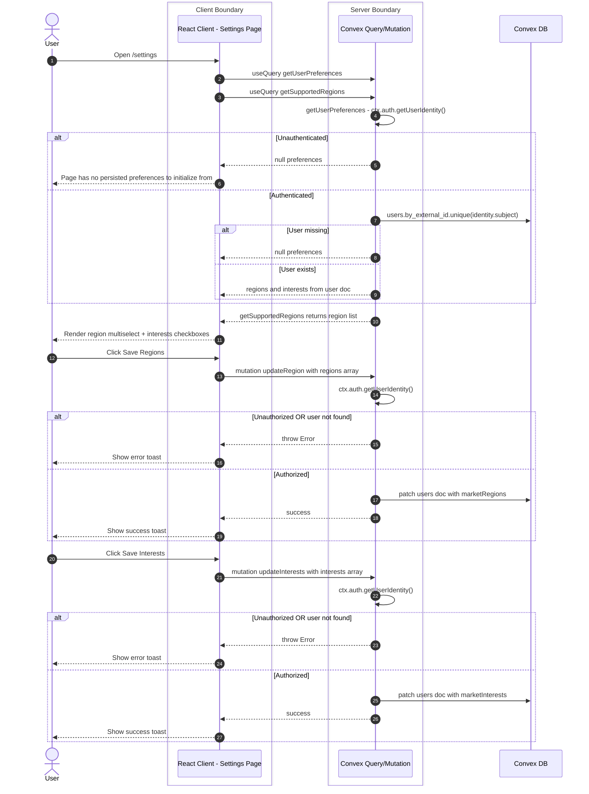

## 3. Scheduled Ingestion + LLM Extraction + Summary Generation

### Relevant Files
- `convex/crons.ts` — Schedules `dailyFetch` (every 24h), `cleanupExpired` (every 168h), and `fetchAllStructuredData` (every 6h).
- `convex/insights/actions.ts` — `dailyFetch` orchestrates per-region ingestion; `fetchRegionData` fetches sources via Jina then runs LLM extraction; `fetchWithJina` handles HTTP fetch.
- `convex/insights/extractMetrics.ts` — `extractDataPointsFromContent` sends article content to OpenRouter LLM to extract structured data points and numeric metrics. Runs in Node runtime.
- `convex/insights/marketSummary.ts` — `generateMarketSummary` sends region metrics + recent insights to OpenRouter LLM. Runs in Node runtime.
- `convex/insights/queries.ts` — `getActiveRegions` returns all user-configured regions.
- `convex/insights/sources.ts` — Resolves per-region source list.
- `convex/insights/mutations.ts` — `storeInsight` (with dataPoints + aiSummary), `logFetch`.
- `convex/insights/metricsMutations.ts` — `upsertMetric`, `upsertMarketSummary`.
- `convex/insights/metricsQueries.ts` — `getMetricsByRegion` internal query for summary generation.
- `convex/insights/marketSummaryQueries.ts` — `getRecentInsightSummaries` internal query for summary generation.
- `convex/insights/metrics.schema.ts` — `NATIONAL_REGION_KEY` constant, table definitions.

### User Flow

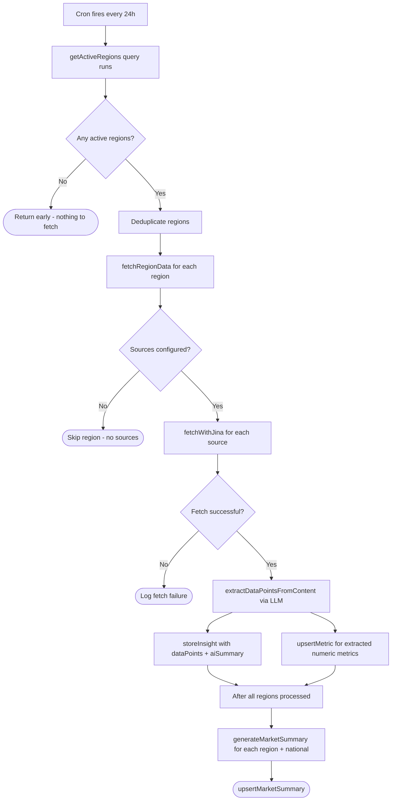

### Step Function Map

| Step | User-visible step | Related function(s) | Primary file(s) |
|---|---|---|---|
| 1 | Daily ingestion cron trigger | `crons.interval(24h, dailyFetch)` | `convex/crons.ts` |
| 2 | Collect active regions | `getActiveRegions` | `convex/insights/queries.ts` |
| 3 | Deduplicate region targets | Region dedupe logic | `convex/insights/actions.ts` |
| 4 | Fetch each region | `fetchRegionData` | `convex/insights/actions.ts` |
| 5 | Check source availability | `hasSourcesForRegion` | `convex/insights/sources.ts` |
| 6 | Fetch source content via Jina | `fetchWithJina` | `convex/insights/actions.ts` |
| 7 | Extract structured data via LLM | `extractDataPointsFromContent` | `convex/insights/extractMetrics.ts` |
| 8 | Store insight with enriched data | `storeInsight` | `convex/insights/mutations.ts` |
| 9 | Upsert AI-extracted metrics | `upsertMetric` | `convex/insights/metricsMutations.ts` |
| 10 | Generate AI market summary | `generateMarketSummary` | `convex/insights/marketSummary.ts` |
| 11 | Persist market summary | `upsertMarketSummary` | `convex/insights/metricsMutations.ts` |

### Technical Sequence

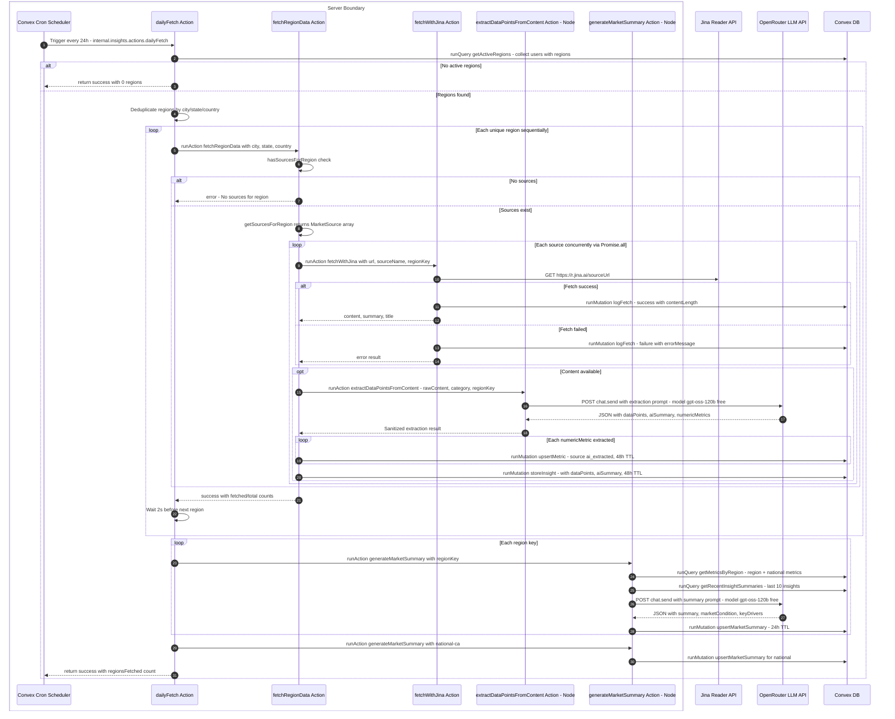

## 4. Structured API Data Fetch (Bank of Canada)

### Relevant Files
- `convex/crons.ts` — Schedules `fetchAllStructuredData` every 6 hours.
- `convex/insights/apiFetchers.ts` — `fetchAllStructuredData` orchestrator and `fetchBankOfCanadaRates` fetcher. Uses default Convex runtime (no Node).
- `convex/insights/metricsMutations.ts` — `upsertMetric` persists rate data.
- `convex/insights/metrics.schema.ts` — `NATIONAL_REGION_KEY` constant, `marketMetrics` table definition.

### User Flow

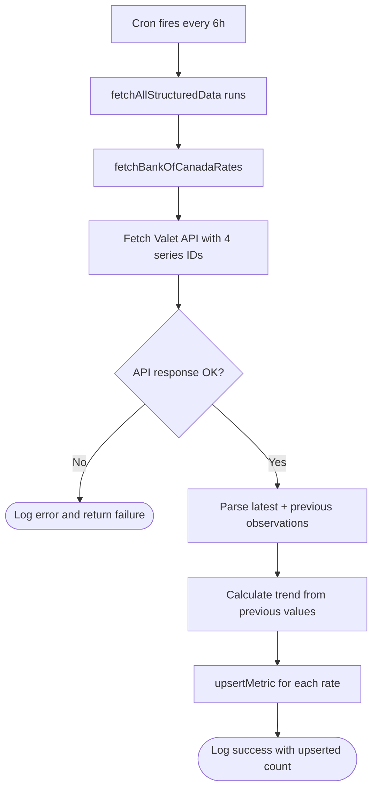

### Step Function Map

| Step | User-visible step | Related function(s) | Primary file(s) |
|---|---|---|---|
| 1 | 6-hour cron trigger | `crons.interval(6h, fetchAllStructuredData)` | `convex/crons.ts` |
| 2 | Orchestrate structured data sources | `fetchAllStructuredData` | `convex/insights/apiFetchers.ts` |
| 3 | Fetch Bank of Canada Valet API | `fetchBankOfCanadaRates` | `convex/insights/apiFetchers.ts` |
| 4 | Parse observations and calculate trends | Rate parsing logic | `convex/insights/apiFetchers.ts` |
| 5 | Upsert metrics into DB | `upsertMetric` | `convex/insights/metricsMutations.ts` |

### Technical Sequence

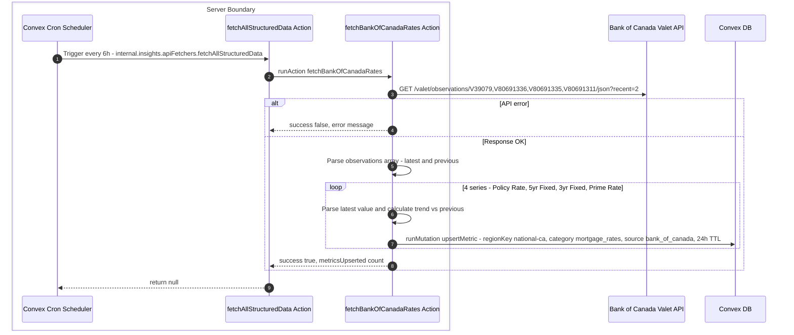

## 5. Expiry Cleanup

### Relevant Files
- `convex/crons.ts` — Schedules `cleanupExpired` every 168 hours (weekly).
- `convex/insights/mutations.ts` — `cleanupExpired` deletes expired rows from all three tables.
- `convex/insights/insight.schema.ts` — Defines `marketInsights` table with `by_expires` index.
- `convex/insights/metrics.schema.ts` — Defines `marketMetrics` and `marketSummaries` tables with `by_expires` indexes.

### User Flow

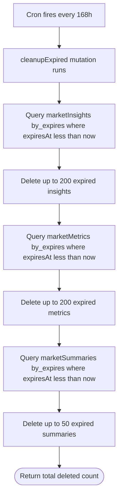

### Step Function Map

| Step | User-visible step | Related function(s) | Primary file(s) |
|---|---|---|---|
| 1 | Weekly cleanup cron trigger | `crons.interval(168h, cleanupExpired)` | `convex/crons.ts` |
| 2 | Delete expired insights | `cleanupExpired` - marketInsights | `convex/insights/mutations.ts` |
| 3 | Delete expired metrics | `cleanupExpired` - marketMetrics | `convex/insights/mutations.ts` |
| 4 | Delete expired summaries | `cleanupExpired` - marketSummaries | `convex/insights/mutations.ts` |

### Technical Sequence

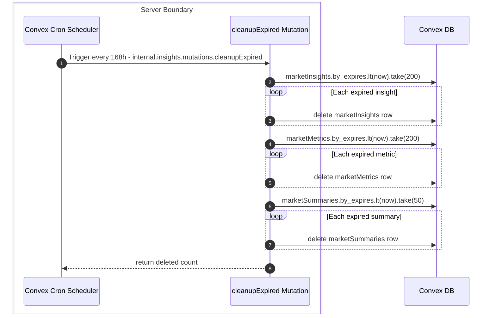

## 6. Manual Region Fetch

### Relevant Files
- `convex/insights/actions.ts` — Public `manualFetch` action gates access with auth and runs `fetchRegionData` + `fetchAllStructuredData` in parallel.
- `convex/insights/apiFetchers.ts` — `fetchAllStructuredData` orchestrates Bank of Canada rate fetch.
- `convex/insights/mutations.ts` — `logFetch` and `storeInsight` persist fetch outcomes.
- `convex/insights/extractMetrics.ts` — LLM extraction runs as part of `fetchRegionData` pipeline.
- `convex/insights/metricsMutations.ts` — `upsertMetric` persists extracted and API metrics.

### User Flow

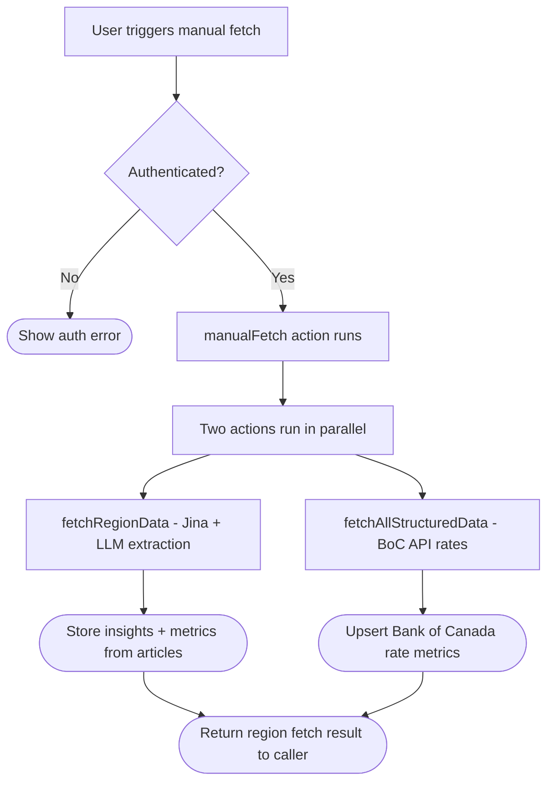

### Step Function Map

| Step | User-visible step | Related function(s) | Primary file(s) |
|---|---|---|---|
| 1 | Trigger manual fetch | Manual fetch trigger | `convex/insights/actions.ts` |
| 2 | Verify auth | `ctx.auth.getUserIdentity` | `convex/insights/actions.ts` |
| 3 | Show auth error | UI-only | caller UI / Convex dashboard |
| 4 | Start parallel fetch | `manualFetch` runs Promise.all | `convex/insights/actions.ts` |
| 5 | Fetch region articles + extract | `fetchRegionData` pipeline | `convex/insights/actions.ts`, `convex/insights/extractMetrics.ts` |
| 6 | Fetch structured API data | `fetchAllStructuredData` | `convex/insights/apiFetchers.ts` |
| 7 | Persist and report summary | `storeInsight`, `upsertMetric`, `logFetch` | `convex/insights/mutations.ts`, `convex/insights/metricsMutations.ts` |

### Technical Sequence

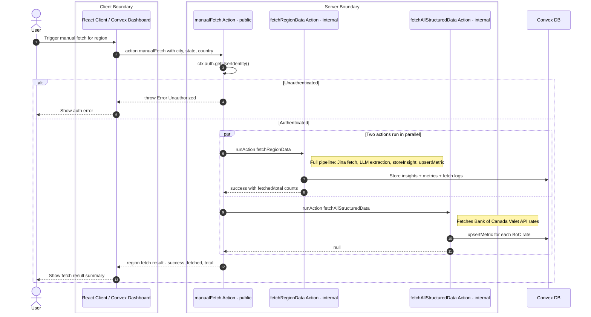

## 7. Data Model

### Tables

| Table | Purpose | Key Indexes | TTL |
|---|---|---|---|
| `marketInsights` | Scraped article content with AI-extracted data points | `by_region`, `by_region_category`, `by_expires` | 48h |
| `marketMetrics` | Structured numeric data points (BoC rates, AI-extracted prices) | `by_region`, `by_region_and_metric`, `by_region_and_category`, `by_expires` | 24-48h |
| `marketSummaries` | AI-generated market snapshot per region | `by_region`, `by_expires` | 24h |
| `insightFetchLog` | Fetch attempt logs for debugging | `by_region` | N/A |

### State Diagram: Metric Data Lifecycle

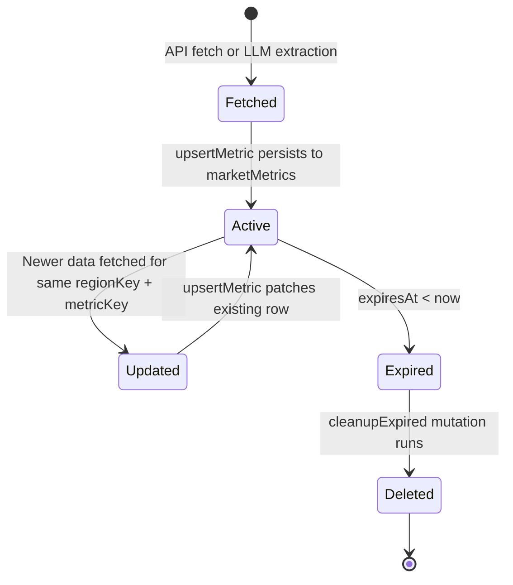

### Cron Schedule Summary

| Cron Name | Interval | Target Function | Purpose |
|---|---|---|---|
| `daily-market-insights` | 24h | `dailyFetch` | Scrape articles, run LLM extraction, generate summaries |
| `fetch-structured-api-data` | 6h | `fetchAllStructuredData` | Fetch Bank of Canada rates |
| `cleanup-expired-insights` | 168h | `cleanupExpired` | Delete expired rows from all 3 tables |
