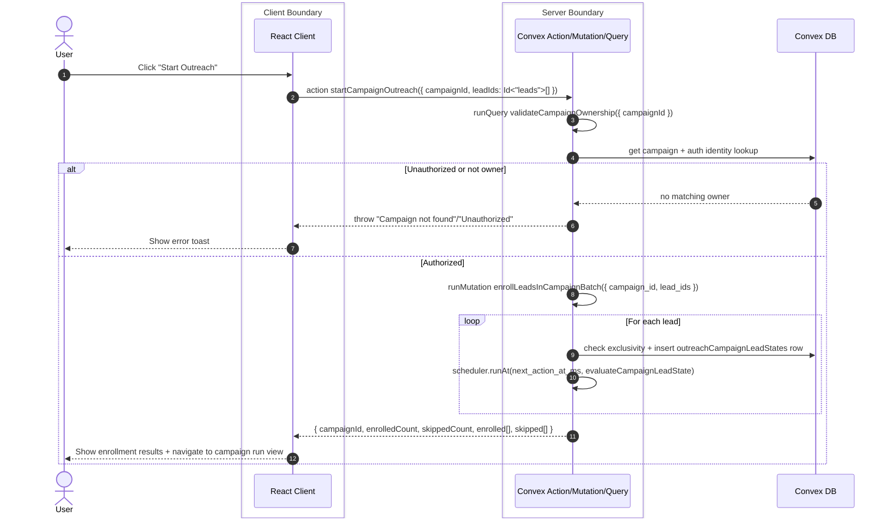
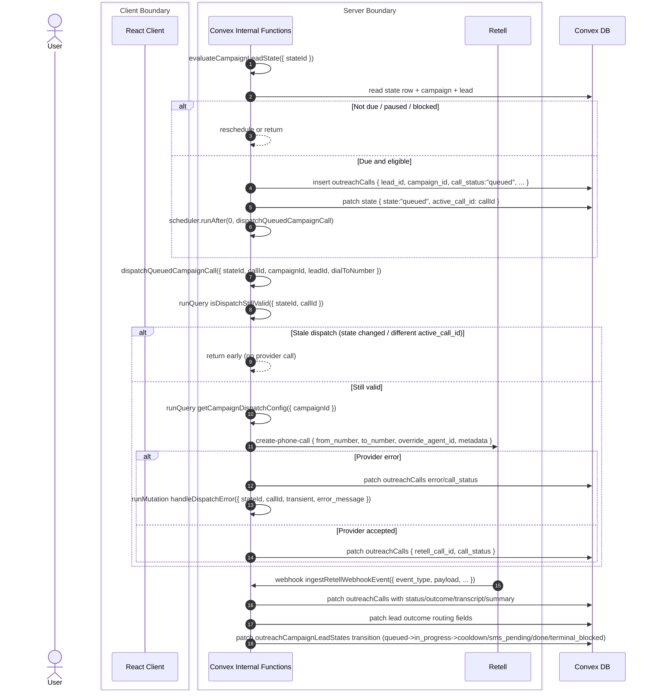
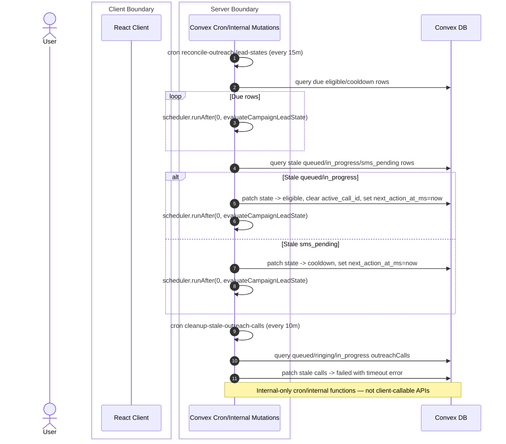

# Outreach Campaign Automation

## 1. Campaign Start And Enrollment

### Relevant Files
- `app/(app)/leads/components/OutreachLeadPicker.tsx` - Triggers `startCampaignOutreach` from campaign picker flows.
- `app/(app)/leads/components/outreach/StartOutreachWizardModal.tsx` - Collects selected lead IDs and sends start payload.
- `convex/outreach/actions.ts` - `startCampaignOutreach` action is the server entrypoint.
- `convex/outreach/auth.ts` - `validateCampaignOwnership` enforces authenticated ownership.
- `convex/outreach/campaignLeadState.ts` - `enrollLeadsInCampaignBatch` inserts state rows and schedules first evaluations.
- `convex/outreach/callingWindow.ts` - Computes immediate vs delayed first run times.
- `convex/outreach/outreach.schema.ts` - Defines `outreachCampaignLeadStates` table and indexes.

## 2. Dispatch, Call Events, And State Transitions

### Relevant Files
- `convex/outreach/campaignLeadState.ts` - Evaluates eligibility, reserves slot, creates call row, and exposes dispatch validity guards.
- `convex/outreach/actions.ts` - `dispatchQueuedCampaignCall` performs pre-flight validity check and provider call creation.
- `convex/outreach/mutations.ts` - `recordCallDispatchResult` and `ingestRetellWebhookEvent` update call records and lead outcomes.
- `convex/outreach/mutations.ts` - Inline transition helper updates campaign lead state on `call_started` / `call_ended`.
- `convex/outreach/queries.ts` - `getCampaignDispatchConfig` reads campaign dispatch configuration.

## 3. Watchdog Reconciliation And Stale Recovery

### Relevant Files
- `convex/crons.ts` - Schedules watchdog jobs (`cleanup-stale-outreach-calls`, `reconcile-outreach-lead-states`).
- `convex/outreach/campaignLeadState.ts` - `reconcileDueCampaignLeadStates` re-schedules due rows and repairs stale queued/in_progress/sms_pending state rows.
- `convex/outreach/mutations.ts` - `cleanupStaleActiveCalls` closes stale queued/ringing/in_progress call records.
- `convex/outreach/actions.ts` - `dispatchFollowUpSms` remains event-driven from scheduled jobs.

