# Outreach Campaign Automation

## 1. Campaign Start And Enrollment

### Relevant Files
- `app/(app)/leads/components/OutreachLeadPicker.tsx` - Triggers `startCampaignOutreach` from campaign picker flows.
- `app/(app)/leads/components/outreach/StartOutreachWizardModal.tsx` - Collects selected lead IDs and sends start payload.
- `convex/outreach/actions.ts` - `startCampaignOutreach` action is the server entrypoint.
- `convex/outreach/auth.ts` - `validateCampaignOwnership` enforces authenticated ownership.
- `convex/outreach/campaignLeadState.ts` - `enrollLeadsInCampaignBatch` inserts state rows and schedules first evaluations.
- `convex/outreach/callingWindow.ts` - Computes immediate vs delayed first run times.
- `convex/outreach/outreach.schema.ts` - Defines `outreachCampaignLeadStates` table and indexes.

### User Flow

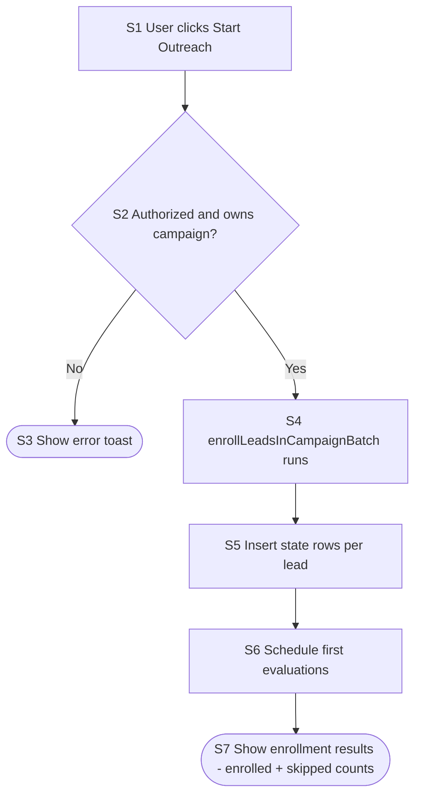
```mermaid
flowchart TD
    A[S1 User clicks Start Outreach] --> B{S2 Authorized and owns campaign?}
    B -->|No| C([S3 Show error toast])
    B -->|Yes| D[S4 enrollLeadsInCampaignBatch runs]
    D --> E[S5 Insert state rows per lead]
    E --> F[S6 Schedule first evaluations]
    F --> G([S7 Show enrollment results - enrolled + skipped counts])
```

### Step Function Map

| Step | User-visible step | Related function(s) | Primary file(s) |
|---|---|---|---|
| S1 | Click Start Outreach | Start wizard submit handler | `app/(app)/leads/components/outreach/StartOutreachWizardModal.tsx` |
| S2 | Validate ownership | `validateCampaignOwnership` | `convex/outreach/auth.ts` |
| S3 | Show auth/ownership error | UI-only | `app/(app)/leads/components/OutreachLeadPicker.tsx` |
| S4 | Enroll selected leads | `startCampaignOutreach`, `enrollLeadsInCampaignBatch` | `convex/outreach/actions.ts`, `convex/outreach/campaignLeadState.ts` |
| S5 | Create lead state rows | `enrollLeadsInCampaignBatch` | `convex/outreach/campaignLeadState.ts` |
| S6 | Schedule first evaluations | `scheduler.runAt(... evaluateCampaignLeadState ...)` | `convex/outreach/campaignLeadState.ts` |
| S7 | Show enrollment summary | UI-only | `app/(app)/leads/components/outreach/StartOutreachWizardModal.tsx` |

### Technical Sequence

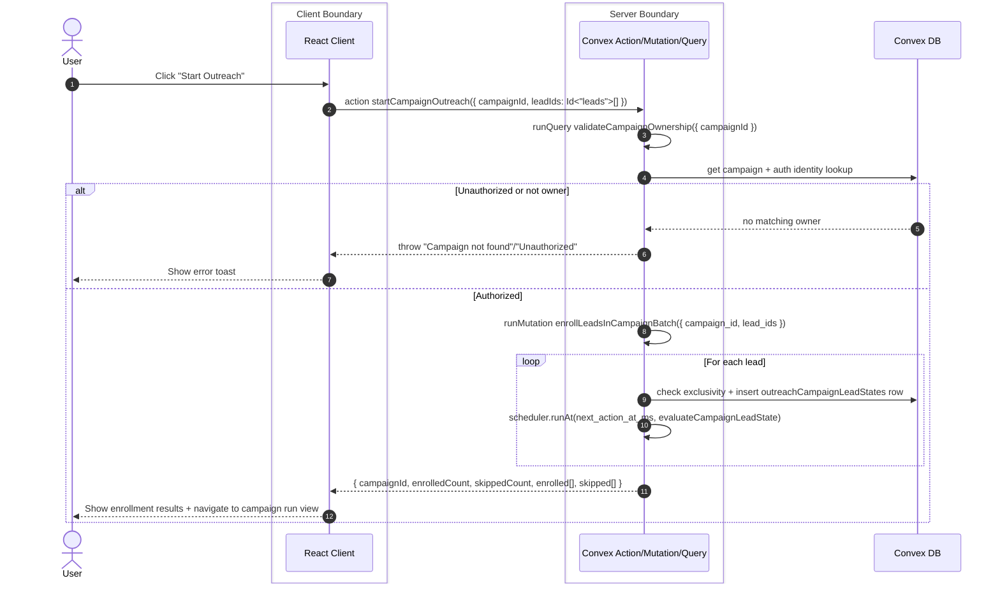
```mermaid
sequenceDiagram
autonumber
actor User
box Client Boundary
participant Client as React Client
end
box Server Boundary
participant Server as Convex Action/Mutation/Query
end
participant DB as Convex DB

User->>Client: Click "Start Outreach"
Client->>Server: action startCampaignOutreach({ campaignId, leadIds: Id<"leads">[] })
Server->>Server: runQuery validateCampaignOwnership({ campaignId })
Server->>DB: get campaign + auth identity lookup
alt Unauthorized or not owner
  DB-->>Server: no matching owner
  Server-->>Client: throw "Campaign not found"/"Unauthorized"
  Client-->>User: Show error toast
else Authorized
  Server->>Server: runMutation enrollLeadsInCampaignBatch({ campaign_id, lead_ids })
  loop For each lead
    Server->>DB: check exclusivity + insert outreachCampaignLeadStates row
    Server->>Server: scheduler.runAt(next_action_at_ms, evaluateCampaignLeadState)
  end
  Server-->>Client: { campaignId, enrolledCount, skippedCount, enrolled[], skipped[] }
  Client-->>User: Show enrollment results + navigate to campaign run view
end
```

## 2. Dispatch, Call Events, And State Transitions

### Relevant Files
- `convex/outreach/campaignLeadState.ts` - Evaluates eligibility, reserves slot, creates call row, and exposes dispatch validity guards.
- `convex/outreach/actions.ts` - `dispatchQueuedCampaignCall` performs pre-flight validity check and provider call creation.
- `convex/outreach/mutations.ts` - `recordCallDispatchResult` and `ingestRetellWebhookEvent` update call records and lead outcomes.
- `convex/outreach/mutations.ts` - Inline transition helper updates campaign lead state on `call_started` / `call_ended`.
- `convex/outreach/queries.ts` - `getCampaignDispatchConfig` reads campaign dispatch configuration.

### User Flow

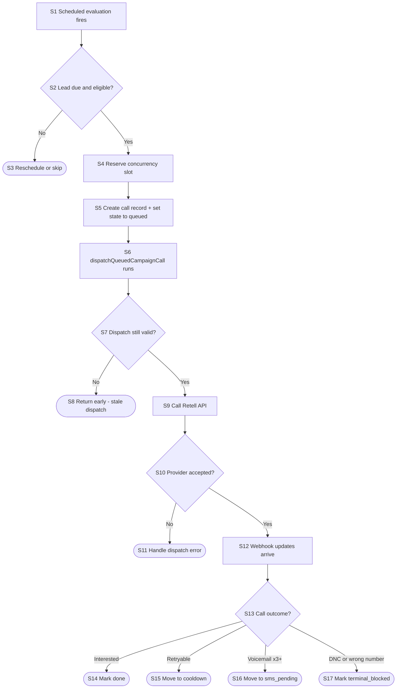
```mermaid
flowchart TD
    A[S1 Scheduled evaluation fires] --> B{S2 Lead due and eligible?}
    B -->|No| C([S3 Reschedule or skip])
    B -->|Yes| D[S4 Reserve concurrency slot]
    D --> E[S5 Create call record + set state to queued]
    E --> F[S6 dispatchQueuedCampaignCall runs]
    F --> G{S7 Dispatch still valid?}
    G -->|No| H([S8 Return early - stale dispatch])
    G -->|Yes| I[S9 Call Retell API]
    I --> J{S10 Provider accepted?}
    J -->|No| K([S11 Handle dispatch error])
    J -->|Yes| L[S12 Webhook updates arrive]
    L --> M{S13 Call outcome?}
    M -->|Interested| N([S14 Mark done])
    M -->|Retryable| O([S15 Move to cooldown])
    M -->|Voicemail x3+| P([S16 Move to sms_pending])
    M -->|DNC or wrong number| Q([S17 Mark terminal_blocked])
```

### Step Function Map

| Step | User-visible step | Related function(s) | Primary file(s) |
|---|---|---|---|
| S1 | Scheduled lead evaluation starts | `evaluateCampaignLeadState` | `convex/outreach/campaignLeadState.ts` |
| S2 | Check due/eligibility | `evaluateCampaignLeadState` guards | `convex/outreach/campaignLeadState.ts` |
| S3 | Skip or reschedule | `evaluateCampaignLeadState` reschedule branch | `convex/outreach/campaignLeadState.ts` |
| S4 | Reserve call slot | `tryReserveCallSlotAndQueueImpl` | `convex/outreach/campaignLeadState.ts` |
| S5 | Queue call and state | `tryReserveCallSlotAndQueueImpl` | `convex/outreach/campaignLeadState.ts` |
| S6 | Start provider dispatch | `dispatchQueuedCampaignCall` | `convex/outreach/actions.ts` |
| S7 | Validate dispatch is current | `isDispatchStillValid` | `convex/outreach/campaignLeadState.ts` |
| S8 | Exit stale dispatch | `dispatchQueuedCampaignCall` early return | `convex/outreach/actions.ts` |
| S9 | Create Retell call | `dispatchQueuedCampaignCall` provider request | `convex/outreach/actions.ts` |
| S10 | Check provider acceptance | `recordCallDispatchResult` path split | `convex/outreach/mutations.ts` |
| S11 | Apply dispatch error policy | `handleDispatchError` | `convex/outreach/campaignLeadState.ts` |
| S12 | Ingest webhook updates | `ingestRetellWebhookEvent` | `convex/outreach/mutations.ts` |
| S13 | Evaluate final outcome | `transitionStateOnCallEvent` | `convex/outreach/mutations.ts` |
| S14 | Move to success terminal | `transitionStateOnCallEvent` -> `done` | `convex/outreach/mutations.ts` |
| S15 | Move to retry cooldown | `transitionStateOnCallEvent` -> `cooldown` | `convex/outreach/mutations.ts` |
| S16 | Move to SMS follow-up | `transitionStateOnCallEvent` -> `sms_pending` | `convex/outreach/mutations.ts` |
| S17 | Move to terminal blocked | `transitionStateOnCallEvent` -> `terminal_blocked` | `convex/outreach/mutations.ts` |

### Technical Sequence

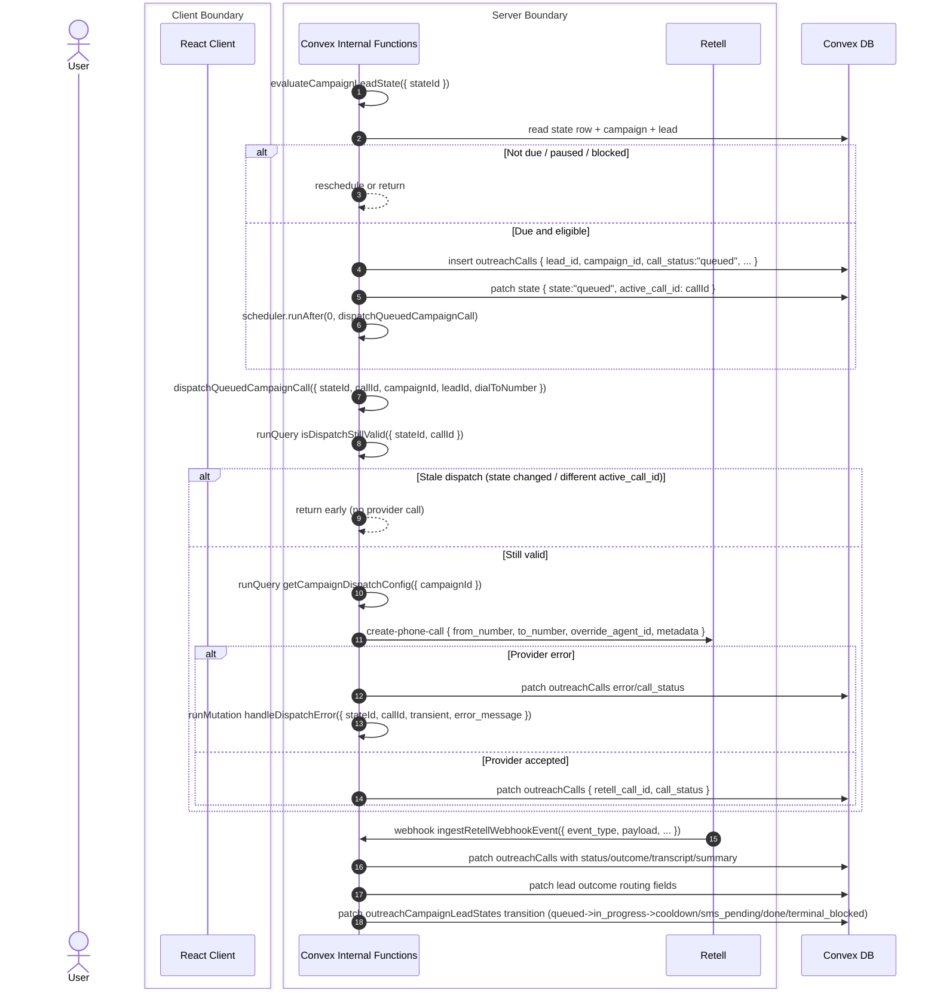
```mermaid
sequenceDiagram
autonumber
actor User
box Client Boundary
participant Client as React Client
end
box Server Boundary
participant Server as Convex Internal Functions
participant Provider as Retell
end
participant DB as Convex DB

Server->>Server: evaluateCampaignLeadState({ stateId })
Server->>DB: read state row + campaign + lead
alt Not due / paused / blocked
  Server-->>Server: reschedule or return
else Due and eligible
  Server->>DB: insert outreachCalls { lead_id, campaign_id, call_status:"queued", ... }
  Server->>DB: patch state { state:"queued", active_call_id: callId }
  Server->>Server: scheduler.runAfter(0, dispatchQueuedCampaignCall)
end

Server->>Server: dispatchQueuedCampaignCall({ stateId, callId, campaignId, leadId, dialToNumber })
Server->>Server: runQuery isDispatchStillValid({ stateId, callId })
alt Stale dispatch (state changed / different active_call_id)
  Server-->>Server: return early (no provider call)
else Still valid
  Server->>Server: runQuery getCampaignDispatchConfig({ campaignId })
  Server->>Provider: create-phone-call { from_number, to_number, override_agent_id, metadata }
  alt Provider error
    Server->>DB: patch outreachCalls error/call_status
    Server->>Server: runMutation handleDispatchError({ stateId, callId, transient, error_message })
  else Provider accepted
    Server->>DB: patch outreachCalls { retell_call_id, call_status }
  end
end

Provider->>Server: webhook ingestRetellWebhookEvent({ event_type, payload, ... })
Server->>DB: patch outreachCalls with status/outcome/transcript/summary
Server->>DB: patch lead outcome routing fields
Server->>DB: patch outreachCampaignLeadStates transition (queued->in_progress->cooldown/sms_pending/done/terminal_blocked)
```

## 3. Watchdog Reconciliation And Stale Recovery

### Relevant Files
- `convex/crons.ts` - Schedules watchdog jobs (`cleanup-stale-outreach-calls`, `reconcile-outreach-lead-states`).
- `convex/outreach/campaignLeadState.ts` - `reconcileDueCampaignLeadStates` re-schedules due rows and repairs stale queued/in_progress/sms_pending state rows.
- `convex/outreach/mutations.ts` - `cleanupStaleActiveCalls` closes stale queued/ringing/in_progress call records.
- `convex/outreach/actions.ts` - `dispatchFollowUpSms` remains event-driven from scheduled jobs.

### User Flow

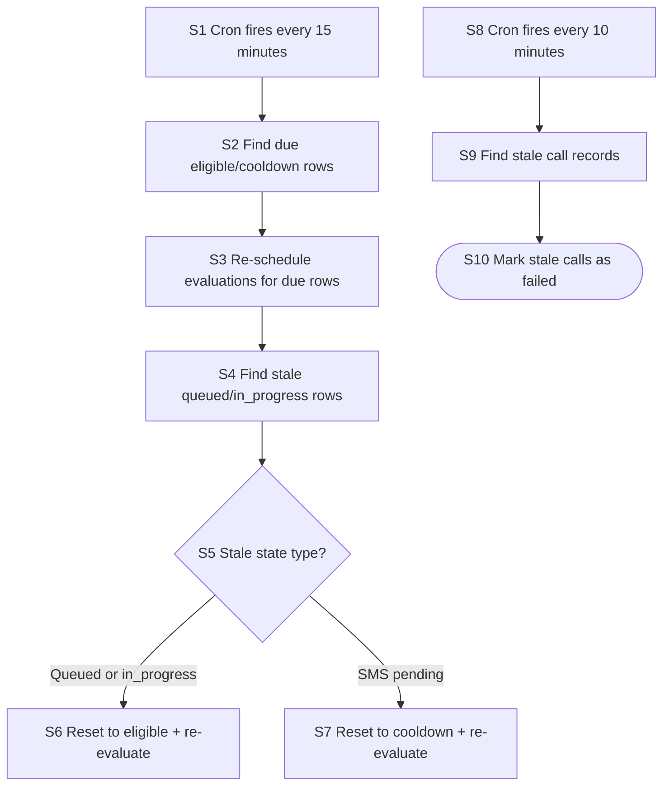
```mermaid
flowchart TD
    A[S1 Cron fires every 15 minutes] --> B[S2 Find due eligible/cooldown rows]
    B --> C[S3 Re-schedule evaluations for due rows]
    C --> D[S4 Find stale queued/in_progress rows]
    D --> E{S5 Stale state type?}
    E -->|Queued or in_progress| F[S6 Reset to eligible + re-evaluate]
    E -->|SMS pending| G[S7 Reset to cooldown + re-evaluate]

    H[S8 Cron fires every 10 minutes] --> I[S9 Find stale call records]
    I --> J([S10 Mark stale calls as failed])
```

### Step Function Map

| Step | User-visible step | Related function(s) | Primary file(s) |
|---|---|---|---|
| S1 | Reconciliation cron trigger | `reconcile-outreach-lead-states` schedule | `convex/crons.ts` |
| S2 | Load due eligible/cooldown rows | `reconcileDueCampaignLeadStates` | `convex/outreach/campaignLeadState.ts` |
| S3 | Re-schedule due evaluations | `scheduler.runAfter(... evaluateCampaignLeadState ...)` | `convex/outreach/campaignLeadState.ts` |
| S4 | Load stale active states | `reconcileDueCampaignLeadStates` stale query | `convex/outreach/campaignLeadState.ts` |
| S5 | Classify stale state type | `reconcileDueCampaignLeadStates` branch | `convex/outreach/campaignLeadState.ts` |
| S6 | Repair queued/in_progress state | `reconcileDueCampaignLeadStates` reset to `eligible` | `convex/outreach/campaignLeadState.ts` |
| S7 | Repair sms_pending state | `reconcileDueCampaignLeadStates` reset to `cooldown` | `convex/outreach/campaignLeadState.ts` |
| S8 | Stale call cleanup cron trigger | `cleanup-stale-outreach-calls` schedule | `convex/crons.ts` |
| S9 | Load stale call records | `cleanupStaleActiveCalls` | `convex/outreach/mutations.ts` |
| S10 | Mark stale calls failed | `cleanupStaleActiveCalls` | `convex/outreach/mutations.ts` |

### Technical Sequence

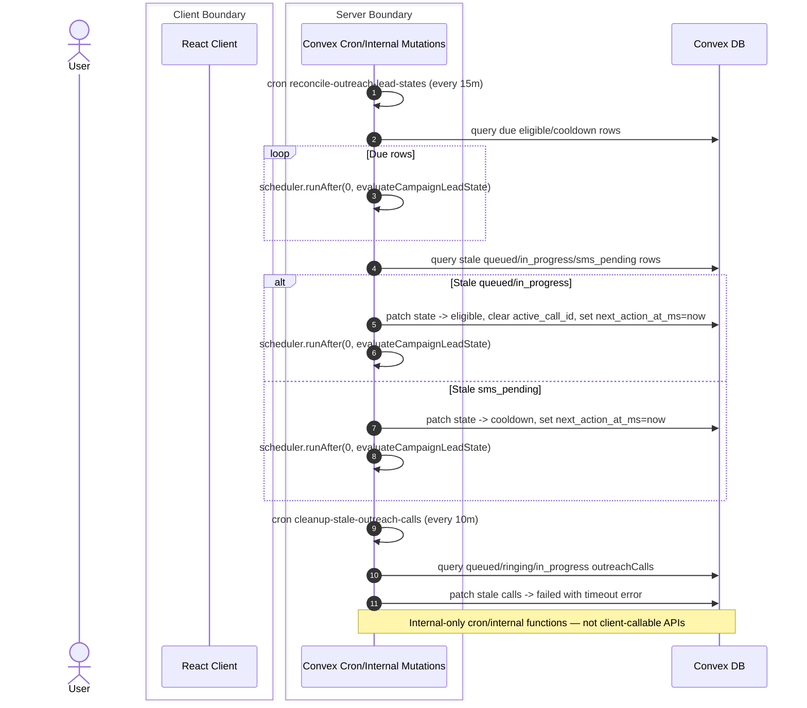
```mermaid
sequenceDiagram
autonumber
actor User
box Client Boundary
participant Client as React Client
end
box Server Boundary
participant Server as Convex Cron/Internal Mutations
end
participant DB as Convex DB

Server->>Server: cron reconcile-outreach-lead-states (every 15m)
Server->>DB: query due eligible/cooldown rows
loop Due rows
  Server->>Server: scheduler.runAfter(0, evaluateCampaignLeadState)
end

Server->>DB: query stale queued/in_progress/sms_pending rows
alt Stale queued/in_progress
  Server->>DB: patch state -> eligible, clear active_call_id, set next_action_at_ms=now
  Server->>Server: scheduler.runAfter(0, evaluateCampaignLeadState)
else Stale sms_pending
  Server->>DB: patch state -> cooldown, set next_action_at_ms=now
  Server->>Server: scheduler.runAfter(0, evaluateCampaignLeadState)
end

Server->>Server: cron cleanup-stale-outreach-calls (every 10m)
Server->>DB: query queued/ringing/in_progress outreachCalls
Server->>DB: patch stale calls -> failed with timeout error
note over Server,DB: Internal-only cron/internal functions — not client-callable APIs
```

## 4. Follow-Up SMS Dispatch

### Relevant Files
- `convex/outreach/mutations.ts` — `queueFollowUpSmsAfterFinalOutcome` checks eligibility (opt-out, DNC, attempt threshold) and schedules dispatch after 3-minute delay.
- `convex/outreach/actions.ts` — `dispatchFollowUpSms` resolves SMS template, validates compliance, sends via Twilio API.
- `convex/outreach/queries.ts` — `getFollowUpSmsDispatchContext` loads call, lead, campaign, and follow-up attempt count for the dispatch action.
- `convex/outreach/mutations.ts` — `recordFollowUpSmsDispatchResult` records Twilio response and drives state transition `sms_pending → cooldown`.
- `convex/outreach/mutations.ts` — `upsertOutreachSmsMessage` creates or updates `outreachSmsMessages` record with provider SID and delivery status.
- `convex/outreach/outreach.schema.ts` — `outreachSmsMessages` table definition.

### User Flow

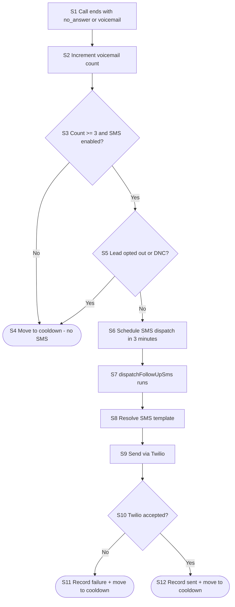
```mermaid
flowchart TD
    A[S1 Call ends with no_answer or voicemail] --> B[S2 Increment voicemail count]
    B --> C{S3 Count >= 3 and SMS enabled?}
    C -->|No| D([S4 Move to cooldown - no SMS])
    C -->|Yes| E{S5 Lead opted out or DNC?}
    E -->|Yes| D
    E -->|No| F[S6 Schedule SMS dispatch in 3 minutes]
    F --> G[S7 dispatchFollowUpSms runs]
    G --> H[S8 Resolve SMS template]
    H --> I[S9 Send via Twilio]
    I --> J{S10 Twilio accepted?}
    J -->|No| K([S11 Record failure + move to cooldown])
    J -->|Yes| L([S12 Record sent + move to cooldown])
```

### Step Function Map

| Step | User-visible step | Related function(s) | Primary file(s) |
|---|---|---|---|
| S1 | Retryable call ends | `ingestRetellWebhookEvent` | `convex/outreach/mutations.ts` |
| S2 | Voicemail/no-answer counter increments | `transitionStateOnCallEvent` | `convex/outreach/mutations.ts` |
| S3 | Check SMS threshold and enablement | `queueFollowUpSmsAfterFinalOutcome` | `convex/outreach/mutations.ts` |
| S4 | Move directly to cooldown | `transitionStateOnCallEvent` | `convex/outreach/mutations.ts` |
| S5 | Check opt-out / DNC compliance | `queueFollowUpSmsAfterFinalOutcome` | `convex/outreach/mutations.ts` |
| S6 | Schedule delayed SMS dispatch | `scheduler.runAfter(... dispatchFollowUpSms ...)` | `convex/outreach/mutations.ts` |
| S7 | Execute SMS dispatch action | `dispatchFollowUpSms` | `convex/outreach/actions.ts` |
| S8 | Resolve outbound template | Template resolution in `dispatchFollowUpSms` | `convex/outreach/actions.ts` |
| S9 | Send message to Twilio | Twilio request in `dispatchFollowUpSms` | `convex/outreach/actions.ts` |
| S10 | Branch on provider result | `recordFollowUpSmsDispatchResult` decision | `convex/outreach/mutations.ts` |
| S11 | Persist failed result | `recordFollowUpSmsDispatchResult`, `upsertOutreachSmsMessage` | `convex/outreach/mutations.ts` |
| S12 | Persist sent result | `recordFollowUpSmsDispatchResult`, `upsertOutreachSmsMessage` | `convex/outreach/mutations.ts` |

### Technical Sequence

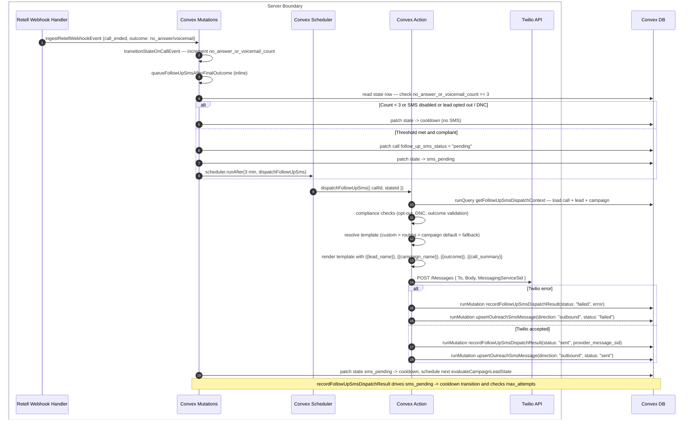
```mermaid
sequenceDiagram
autonumber
box Server Boundary
participant Webhook as Retell Webhook Handler
participant Mut as Convex Mutations
participant Sched as Convex Scheduler
participant Act as Convex Action
participant Twilio as Twilio API
end
participant DB as Convex DB

Webhook->>Mut: ingestRetellWebhookEvent (call_ended, outcome: no_answer/voicemail)
Mut->>Mut: transitionStateOnCallEvent — increment no_answer_or_voicemail_count
Mut->>Mut: queueFollowUpSmsAfterFinalOutcome (inline)
Mut->>DB: read state row — check no_answer_or_voicemail_count >= 3
alt Count < 3 or SMS disabled or lead opted out / DNC
  Mut->>DB: patch state -> cooldown (no SMS)
else Threshold met and compliant
  Mut->>DB: patch call follow_up_sms_status = "pending"
  Mut->>DB: patch state -> sms_pending
  Mut->>Sched: scheduler.runAfter(3 min, dispatchFollowUpSms)
end

Sched->>Act: dispatchFollowUpSms({ callId, stateId })
Act->>DB: runQuery getFollowUpSmsDispatchContext — load call + lead + campaign
Act->>Act: compliance checks (opt-out, DNC, outcome validation)
Act->>Act: resolve template (custom > routing > campaign default > fallback)
Act->>Act: render template with {{lead_name}}, {{campaign_name}}, {{outcome}}, {{call_summary}}
Act->>Twilio: POST /Messages { To, Body, MessagingServiceSid }
alt Twilio error
  Act->>DB: runMutation recordFollowUpSmsDispatchResult(status: "failed", error)
  Act->>DB: runMutation upsertOutreachSmsMessage(direction: "outbound", status: "failed")
else Twilio accepted
  Act->>DB: runMutation recordFollowUpSmsDispatchResult(status: "sent", provider_message_sid)
  Act->>DB: runMutation upsertOutreachSmsMessage(direction: "outbound", status: "sent")
end
Mut->>DB: patch state sms_pending -> cooldown, schedule next evaluateCampaignLeadState
note over Mut,DB: recordFollowUpSmsDispatchResult drives sms_pending -> cooldown transition and checks max_attempts
```

## 5. Inbound SMS And Opt-Out Handling

### Relevant Files
- `convex/http.ts` — Twilio messaging webhook route (`POST /twilio-messaging-webhook`), validates HMAC-SHA1 signature.
- `convex/outreach/mutations.ts` — `ingestTwilioMessagingWebhook` normalizes payload, resolves lead by phone, detects opt-out keywords.
- `convex/outreach/mutations.ts` — `upsertOutreachSmsMessage` creates or updates inbound message record with status transitions.
- `convex/outreach/outreach.schema.ts` — `outreachSmsMessages` table (direction: "inbound").

### User Flow

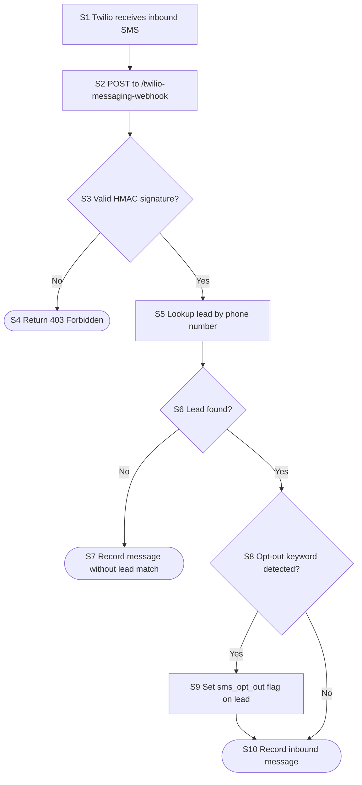
```mermaid
flowchart TD
    A[S1 Twilio receives inbound SMS] --> B[S2 POST to /twilio-messaging-webhook]
    B --> C{S3 Valid HMAC signature?}
    C -->|No| D([S4 Return 403 Forbidden])
    C -->|Yes| E[S5 Lookup lead by phone number]
    E --> F{S6 Lead found?}
    F -->|No| G([S7 Record message without lead match])
    F -->|Yes| H{S8 Opt-out keyword detected?}
    H -->|Yes| I[S9 Set sms_opt_out flag on lead]
    I --> J([S10 Record inbound message])
    H -->|No| J
```

### Step Function Map

| Step | User-visible step | Related function(s) | Primary file(s) |
|---|---|---|---|
| S1 | Twilio receives inbound SMS | External provider event | Twilio |
| S2 | Webhook request reaches app | Twilio webhook route handler | `convex/http.ts` |
| S3 | Verify signature | Twilio HMAC validation logic | `convex/http.ts` |
| S4 | Reject invalid request | HTTP 403 branch | `convex/http.ts` |
| S5 | Resolve lead by phone | `ingestTwilioMessagingWebhook` | `convex/outreach/mutations.ts` |
| S6 | Branch on lead match | `ingestTwilioMessagingWebhook` | `convex/outreach/mutations.ts` |
| S7 | Store unmatched inbound message | `upsertOutreachSmsMessage` | `convex/outreach/mutations.ts` |
| S8 | Check stop keywords | Opt-out detector in `ingestTwilioMessagingWebhook` | `convex/outreach/mutations.ts` |
| S9 | Persist opt-out flag | lead patch in `ingestTwilioMessagingWebhook` | `convex/outreach/mutations.ts` |
| S10 | Persist inbound message | `upsertOutreachSmsMessage` | `convex/outreach/mutations.ts` |

### Technical Sequence

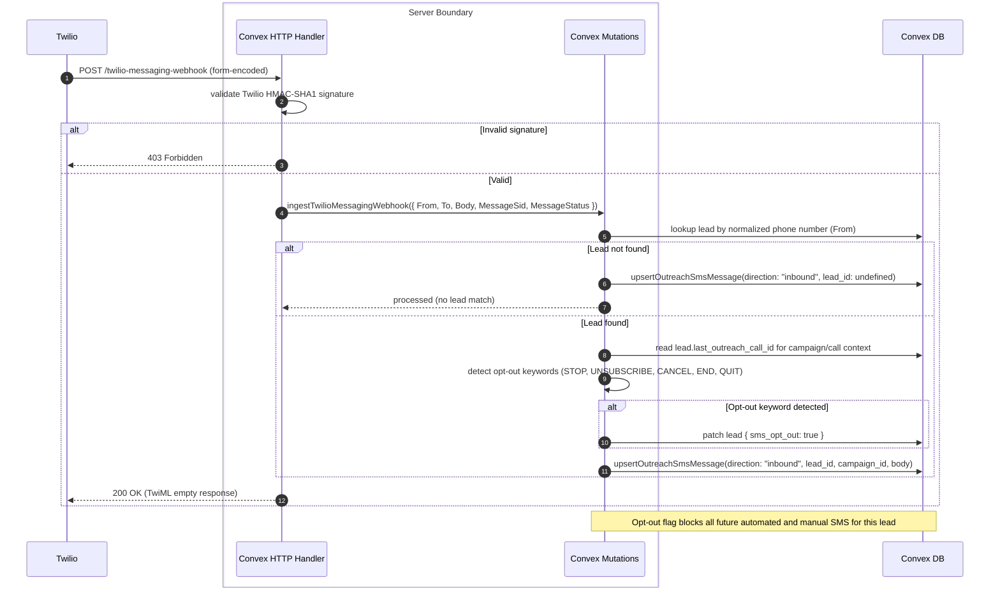
```mermaid
sequenceDiagram
autonumber
participant Twilio as Twilio
box Server Boundary
participant HTTP as Convex HTTP Handler
participant Mut as Convex Mutations
end
participant DB as Convex DB

Twilio->>HTTP: POST /twilio-messaging-webhook (form-encoded)
HTTP->>HTTP: validate Twilio HMAC-SHA1 signature
alt Invalid signature
  HTTP-->>Twilio: 403 Forbidden
else Valid
  HTTP->>Mut: ingestTwilioMessagingWebhook({ From, To, Body, MessageSid, MessageStatus })
  Mut->>DB: lookup lead by normalized phone number (From)
  alt Lead not found
    Mut->>DB: upsertOutreachSmsMessage(direction: "inbound", lead_id: undefined)
    Mut-->>HTTP: processed (no lead match)
  else Lead found
    Mut->>DB: read lead.last_outreach_call_id for campaign/call context
    Mut->>Mut: detect opt-out keywords (STOP, UNSUBSCRIBE, CANCEL, END, QUIT)
    alt Opt-out keyword detected
      Mut->>DB: patch lead { sms_opt_out: true }
    end
    Mut->>DB: upsertOutreachSmsMessage(direction: "inbound", lead_id, campaign_id, body)
  end
  HTTP-->>Twilio: 200 OK (TwiML empty response)
end
note over Mut,DB: Opt-out flag blocks all future automated and manual SMS for this lead
```

## 6. User-Initiated SMS (Conversation)

### Relevant Files
- `app/(app)/leads/components/outreach/LeadConversationDrawer.tsx` — Conversation UI where users compose and send manual SMS messages.
- `convex/outreach/actions.ts` — `sendCampaignConversationSms` authenticates user, validates compliance, sends via Twilio.
- `convex/outreach/queries.ts` — `getCampaignLeadConversation` enforces auth and returns campaign, lead, call history, and SMS thread.
- `convex/outreach/mutations.ts` — `upsertOutreachSmsMessage` records outbound manual message.

### User Flow

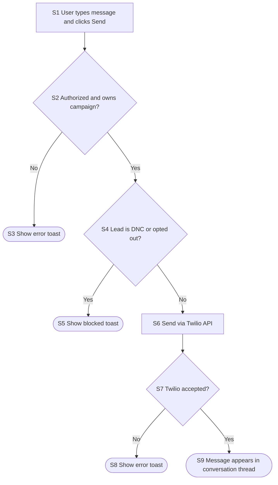
```mermaid
flowchart TD
    A[S1 User types message and clicks Send] --> B{S2 Authorized and owns campaign?}
    B -->|No| C([S3 Show error toast])
    B -->|Yes| D{S4 Lead is DNC or opted out?}
    D -->|Yes| E([S5 Show blocked toast])
    D -->|No| F[S6 Send via Twilio API]
    F --> G{S7 Twilio accepted?}
    G -->|No| H([S8 Show error toast])
    G -->|Yes| I([S9 Message appears in conversation thread])
```

### Step Function Map

| Step | User-visible step | Related function(s) | Primary file(s) |
|---|---|---|---|
| S1 | Send manual SMS from drawer | Send handler | `app/(app)/leads/components/outreach/LeadConversationDrawer.tsx` |
| S2 | Check auth + campaign ownership | `getCampaignLeadConversation` | `convex/outreach/queries.ts` |
| S3 | Show unauthorized error | UI-only | `app/(app)/leads/components/outreach/LeadConversationDrawer.tsx` |
| S4 | Check DNC/opt-out compliance | `sendCampaignConversationSms` | `convex/outreach/actions.ts` |
| S5 | Show compliance blocked message | UI-only | `app/(app)/leads/components/outreach/LeadConversationDrawer.tsx` |
| S6 | Send outbound SMS | `sendCampaignConversationSms` | `convex/outreach/actions.ts` |
| S7 | Branch on Twilio result | Twilio response handling in `sendCampaignConversationSms` | `convex/outreach/actions.ts` |
| S8 | Show send error | UI-only | `app/(app)/leads/components/outreach/LeadConversationDrawer.tsx` |
| S9 | Show sent message in thread | `upsertOutreachSmsMessage` + query refresh | `convex/outreach/mutations.ts`, `convex/outreach/queries.ts` |

### Technical Sequence

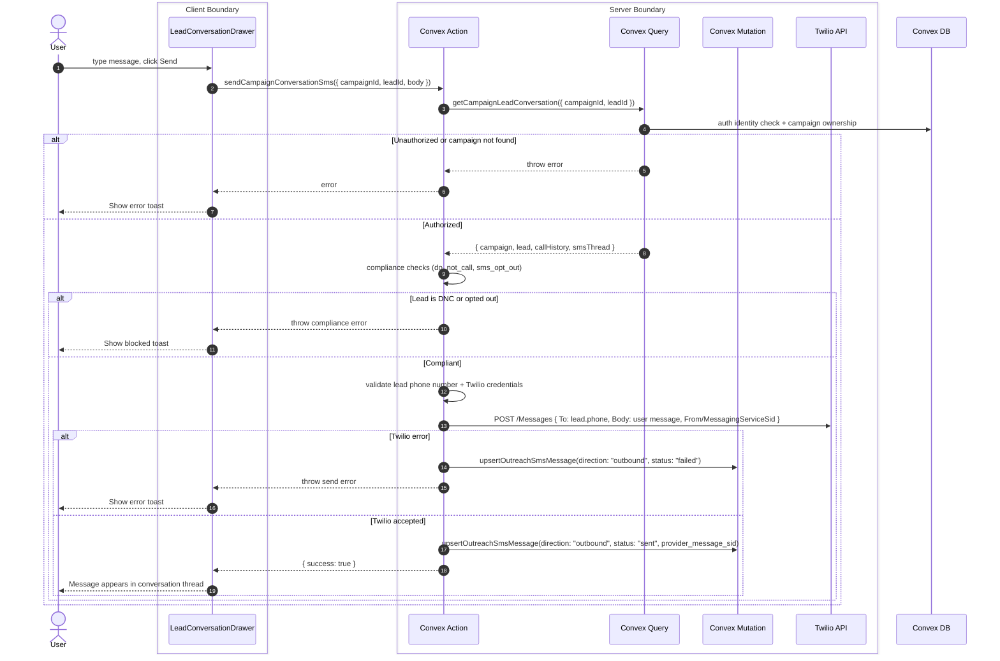
```mermaid
sequenceDiagram
autonumber
actor User
box Client Boundary
participant Client as LeadConversationDrawer
end
box Server Boundary
participant Act as Convex Action
participant Query as Convex Query
participant Mut as Convex Mutation
participant Twilio as Twilio API
end
participant DB as Convex DB

User->>Client: type message, click Send
Client->>Act: sendCampaignConversationSms({ campaignId, leadId, body })
Act->>Query: getCampaignLeadConversation({ campaignId, leadId })
Query->>DB: auth identity check + campaign ownership
alt Unauthorized or campaign not found
  Query-->>Act: throw error
  Act-->>Client: error
  Client-->>User: Show error toast
else Authorized
  Query-->>Act: { campaign, lead, callHistory, smsThread }
  Act->>Act: compliance checks (do_not_call, sms_opt_out)
  alt Lead is DNC or opted out
    Act-->>Client: throw compliance error
    Client-->>User: Show blocked toast
  else Compliant
    Act->>Act: validate lead phone number + Twilio credentials
    Act->>Twilio: POST /Messages { To: lead.phone, Body: user message, From/MessagingServiceSid }
    alt Twilio error
      Act->>Mut: upsertOutreachSmsMessage(direction: "outbound", status: "failed")
      Act-->>Client: throw send error
      Client-->>User: Show error toast
    else Twilio accepted
      Act->>Mut: upsertOutreachSmsMessage(direction: "outbound", status: "sent", provider_message_sid)
      Act-->>Client: { success: true }
      Client-->>User: Message appears in conversation thread
    end
  end
end
```

## 7. Pause, Resume, And Campaign Lifecycle

### Relevant Files
- `convex/outreach/mutations.ts` — `updateCampaignSettings` sets campaign status (active, paused, completed, archived).
- `convex/outreach/campaignLeadState.ts` — `evaluateCampaignLeadState` gates on `campaign.status !== "active"` and exits early without action.
- `convex/outreach/campaignLeadState.ts` — `reconcileDueCampaignLeadStates` picks up due leads within 15 minutes of resume.
- `convex/crons.ts` — Reconciliation cron schedule (every 15 minutes).

### User Flow

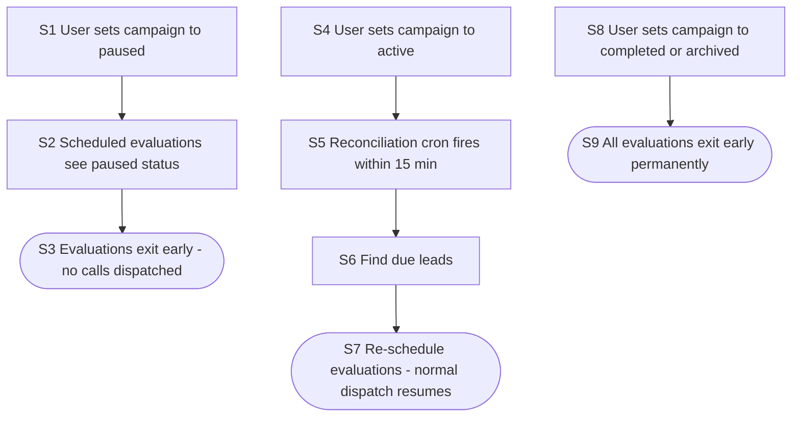
```mermaid
flowchart TD
    A[S1 User sets campaign to paused] --> B[S2 Scheduled evaluations see paused status]
    B --> C([S3 Evaluations exit early - no calls dispatched])

    D[S4 User sets campaign to active] --> E[S5 Reconciliation cron fires within 15 min]
    E --> F[S6 Find due leads]
    F --> G([S7 Re-schedule evaluations - normal dispatch resumes])

    H[S8 User sets campaign to completed or archived] --> I([S9 All evaluations exit early permanently])
```

### Step Function Map

| Step | User-visible step | Related function(s) | Primary file(s) |
|---|---|---|---|
| S1 | Pause campaign | `updateCampaignSettings` | `convex/outreach/mutations.ts` |
| S2 | Evaluations observe paused status | `evaluateCampaignLeadState` guard | `convex/outreach/campaignLeadState.ts` |
| S3 | Skip dispatch while paused | `evaluateCampaignLeadState` early exit | `convex/outreach/campaignLeadState.ts` |
| S4 | Resume campaign | `updateCampaignSettings` | `convex/outreach/mutations.ts` |
| S5 | Reconciliation cron runs | `reconcile-outreach-lead-states` schedule | `convex/crons.ts` |
| S6 | Query due leads after resume | `reconcileDueCampaignLeadStates` | `convex/outreach/campaignLeadState.ts` |
| S7 | Re-queue evaluations | `scheduler.runAfter(... evaluateCampaignLeadState ...)` | `convex/outreach/campaignLeadState.ts` |
| S8 | Complete/archive campaign | `updateCampaignSettings` | `convex/outreach/mutations.ts` |
| S9 | Permanently gate evaluations | `evaluateCampaignLeadState` guard | `convex/outreach/campaignLeadState.ts` |

### Technical Sequence

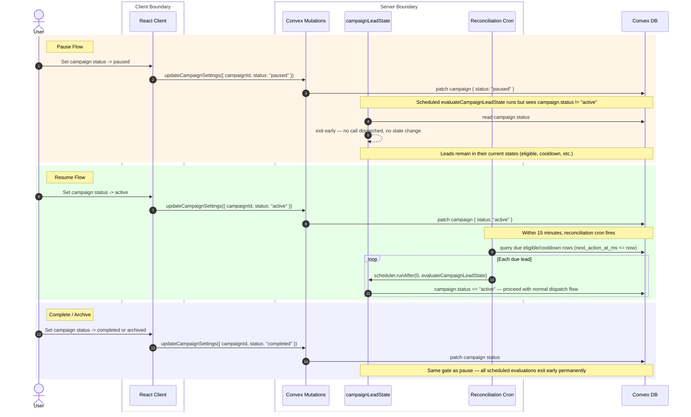
```mermaid
sequenceDiagram
autonumber
actor User
box Client Boundary
participant Client as React Client
end
box Server Boundary
participant Mut as Convex Mutations
participant State as campaignLeadState
participant Cron as Reconciliation Cron
end
participant DB as Convex DB

rect rgb(255, 245, 230)
note right of User: Pause Flow
User->>Client: Set campaign status -> paused
Client->>Mut: updateCampaignSettings({ campaignId, status: "paused" })
Mut->>DB: patch campaign { status: "paused" }
note over State,DB: Scheduled evaluateCampaignLeadState runs but sees campaign.status != "active"
State->>DB: read campaign.status
State-->>State: exit early — no call dispatched, no state change
note over State,DB: Leads remain in their current states (eligible, cooldown, etc.)
end

rect rgb(230, 255, 230)
note right of User: Resume Flow
User->>Client: Set campaign status -> active
Client->>Mut: updateCampaignSettings({ campaignId, status: "active" })
Mut->>DB: patch campaign { status: "active" }
note over Cron,DB: Within 15 minutes, reconciliation cron fires
Cron->>DB: query due eligible/cooldown rows (next_action_at_ms <= now)
loop Each due lead
  Cron->>State: scheduler.runAfter(0, evaluateCampaignLeadState)
  State->>DB: campaign.status == "active" — proceed with normal dispatch flow
end
end

rect rgb(240, 240, 255)
note right of User: Complete / Archive
User->>Client: Set campaign status -> completed or archived
Client->>Mut: updateCampaignSettings({ campaignId, status: "completed" })
Mut->>DB: patch campaign status
note over State,DB: Same gate as pause — all scheduled evaluations exit early permanently
end
```

## 8. Error Recovery And Manual Retry

### Relevant Files
- `convex/outreach/actions.ts` — `dispatchQueuedCampaignCall` classifies dispatch errors as transient (HTTP 429/5xx) or permanent (HTTP 4xx / config errors).
- `convex/outreach/campaignLeadState.ts` — `handleDispatchError` applies transient backoff or permanent error state.
- `convex/outreach/campaignLeadState.ts` — `retryErrorState` resets error leads to eligible with immediate evaluation.
- `convex/outreach/campaignLeadState.ts` — `removeFromCampaign` transitions any state to done (user-initiated removal).

### User Flow

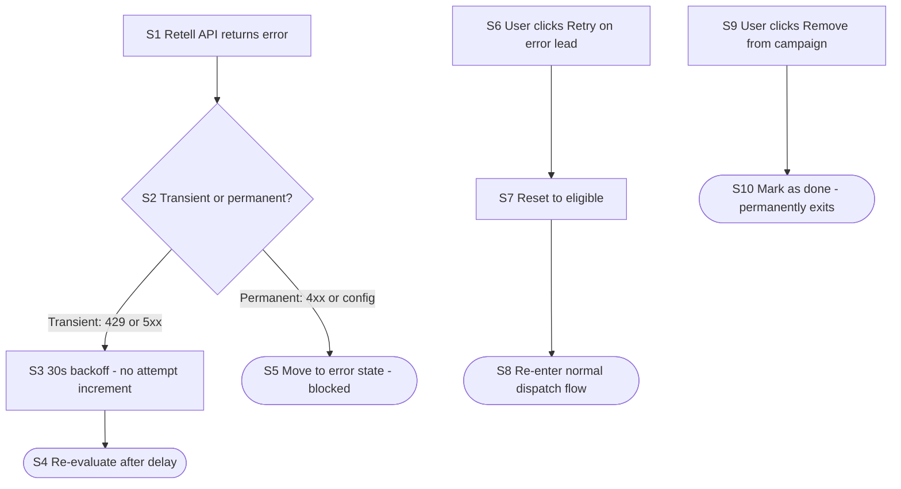
```mermaid
flowchart TD
    A[S1 Retell API returns error] --> B{S2 Transient or permanent?}
    B -->|Transient: 429 or 5xx| C[S3 30s backoff - no attempt increment]
    C --> D([S4 Re-evaluate after delay])
    B -->|Permanent: 4xx or config| E([S5 Move to error state - blocked])

    F[S6 User clicks Retry on error lead] --> G[S7 Reset to eligible]
    G --> H([S8 Re-enter normal dispatch flow])

    I[S9 User clicks Remove from campaign] --> J([S10 Mark as done - permanently exits])
```

### Step Function Map

| Step | User-visible step | Related function(s) | Primary file(s) |
|---|---|---|---|
| S1 | Provider dispatch error occurs | `dispatchQueuedCampaignCall` | `convex/outreach/actions.ts` |
| S2 | Classify transient/permanent | `handleDispatchError` input classification | `convex/outreach/campaignLeadState.ts` |
| S3 | Apply transient backoff | `handleDispatchError(transient: true)` | `convex/outreach/campaignLeadState.ts` |
| S4 | Re-run evaluation after delay | `scheduler.runAt(... evaluateCampaignLeadState ...)` | `convex/outreach/campaignLeadState.ts` |
| S5 | Move lead to error state | `handleDispatchError(transient: false)` | `convex/outreach/campaignLeadState.ts` |
| S6 | User retries errored lead | Retry action in UI | leads outreach UI |
| S7 | Reset state to eligible | `retryErrorState` | `convex/outreach/campaignLeadState.ts` |
| S8 | Re-enter dispatch loop | `evaluateCampaignLeadState` | `convex/outreach/campaignLeadState.ts` |
| S9 | User removes lead | Remove action in UI | leads outreach UI |
| S10 | Permanently mark done | `removeFromCampaign` | `convex/outreach/campaignLeadState.ts` |

### Technical Sequence

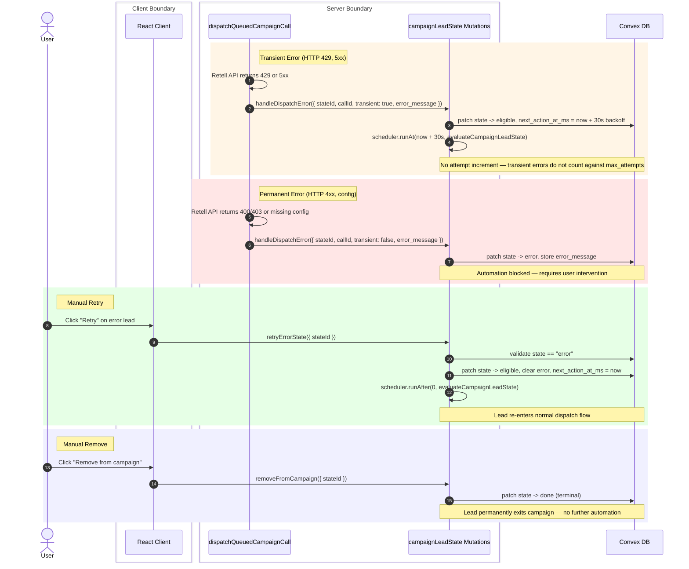
```mermaid
sequenceDiagram
autonumber
actor User
box Client Boundary
participant Client as React Client
end
box Server Boundary
participant Act as dispatchQueuedCampaignCall
participant Mut as campaignLeadState Mutations
end
participant DB as Convex DB

rect rgb(255, 245, 230)
note right of Act: Transient Error (HTTP 429, 5xx)
Act->>Act: Retell API returns 429 or 5xx
Act->>Mut: handleDispatchError({ stateId, callId, transient: true, error_message })
Mut->>DB: patch state -> eligible, next_action_at_ms = now + 30s backoff
Mut->>Mut: scheduler.runAt(now + 30s, evaluateCampaignLeadState)
note over Mut,DB: No attempt increment — transient errors do not count against max_attempts
end

rect rgb(255, 230, 230)
note right of Act: Permanent Error (HTTP 4xx, config)
Act->>Act: Retell API returns 400/403 or missing config
Act->>Mut: handleDispatchError({ stateId, callId, transient: false, error_message })
Mut->>DB: patch state -> error, store error_message
note over Mut,DB: Automation blocked — requires user intervention
end

rect rgb(230, 255, 230)
note right of User: Manual Retry
User->>Client: Click "Retry" on error lead
Client->>Mut: retryErrorState({ stateId })
Mut->>DB: validate state == "error"
Mut->>DB: patch state -> eligible, clear error, next_action_at_ms = now
Mut->>Mut: scheduler.runAfter(0, evaluateCampaignLeadState)
note over Mut,DB: Lead re-enters normal dispatch flow
end

rect rgb(240, 240, 255)
note right of User: Manual Remove
User->>Client: Click "Remove from campaign"
Client->>Mut: removeFromCampaign({ stateId })
Mut->>DB: patch state -> done (terminal)
note over Mut,DB: Lead permanently exits campaign — no further automation
end
```

## 9. Campaign Lead State Machine

All lead-level automation flows through the `outreachCampaignLeadStates` table. Each row tracks one lead's position in one campaign. There are 8 states — 6 active and 2 terminal.

### Relevant Files
- `convex/outreach/campaignLeadState.ts` — All state mutations: `enrollLeadsInCampaignBatch`, `evaluateCampaignLeadState`, `tryReserveCallSlotAndQueueImpl`, `transitionStateOnCallEvent`, `transitionStateOnSmsComplete`, `handleDispatchError`, `retryErrorState`, `removeFromCampaign`, `reconcileDueCampaignLeadStates`.
- `convex/outreach/mutations.ts` — Inline call event handler in `ingestRetellWebhookEvent`, SMS result handler in `recordFollowUpSmsDispatchResult`.
- `convex/outreach/outreach.schema.ts` — State field definition and indexes.

### User Flow

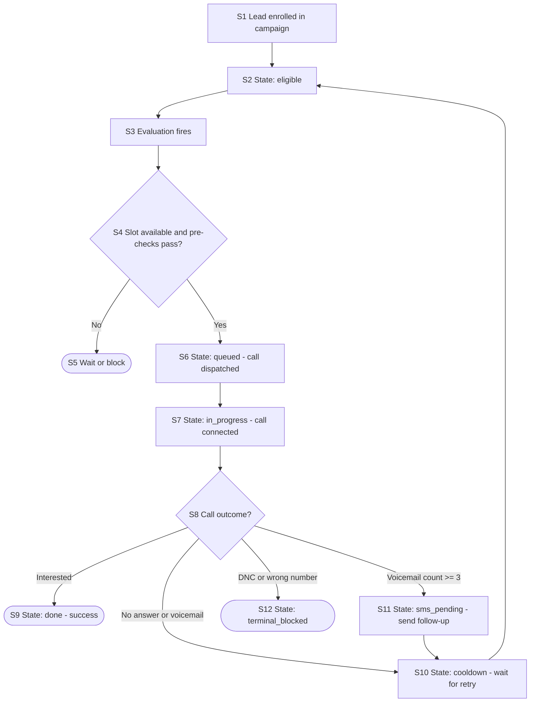
```mermaid
flowchart TD
    A[S1 Lead enrolled in campaign] --> B[S2 State: eligible]
    B --> C[S3 Evaluation fires]
    C --> D{S4 Slot available and pre-checks pass?}
    D -->|No| E([S5 Wait or block])
    D -->|Yes| F[S6 State: queued - call dispatched]
    F --> G[S7 State: in_progress - call connected]
    G --> H{S8 Call outcome?}
    H -->|Interested| I([S9 State: done - success])
    H -->|No answer or voicemail| J[S10 State: cooldown - wait for retry]
    J --> B
    H -->|Voicemail count >= 3| K[S11 State: sms_pending - send follow-up]
    K --> J
    H -->|DNC or wrong number| L([S12 State: terminal_blocked])
```

### Step Function Map

| Step | User-visible step | Related function(s) | Primary file(s) |
|---|---|---|---|
| S1 | Lead is added to campaign | `enrollLeadsInCampaignBatch` | `convex/outreach/campaignLeadState.ts` |
| S2 | Lead starts in eligible state | `enrollLeadsInCampaignBatch` | `convex/outreach/campaignLeadState.ts` |
| S3 | Scheduled evaluation runs | `evaluateCampaignLeadState` | `convex/outreach/campaignLeadState.ts` |
| S4 | Gate on slot + pre-checks | `evaluateCampaignLeadState`, `tryReserveCallSlotAndQueueImpl` | `convex/outreach/campaignLeadState.ts` |
| S5 | Defer or block work | `evaluateCampaignLeadState` guard branches | `convex/outreach/campaignLeadState.ts` |
| S6 | Transition to queued state | `tryReserveCallSlotAndQueueImpl` | `convex/outreach/campaignLeadState.ts` |
| S7 | Transition to in_progress | `transitionStateOnCallEvent` | `convex/outreach/mutations.ts` |
| S8 | Evaluate call outcome | `transitionStateOnCallEvent` | `convex/outreach/mutations.ts` |
| S9 | Transition to done | `transitionStateOnCallEvent` | `convex/outreach/mutations.ts` |
| S10 | Transition to cooldown | `transitionStateOnCallEvent` | `convex/outreach/mutations.ts` |
| S11 | Transition to sms_pending | `transitionStateOnCallEvent`, `queueFollowUpSmsAfterFinalOutcome` | `convex/outreach/mutations.ts` |
| S12 | Transition to terminal_blocked | `transitionStateOnCallEvent` | `convex/outreach/mutations.ts` |

### Technical Sequence

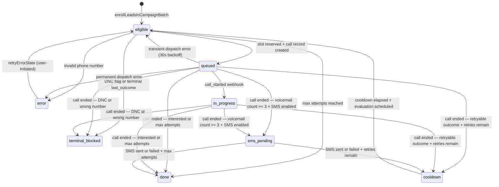
```mermaid
stateDiagram-v2
    [*] --> eligible: enrollLeadsInCampaignBatch

    eligible --> queued: slot reserved + call record created
    eligible --> done: max attempts reached
    eligible --> terminal_blocked: DNC flag or terminal last_outcome
    eligible --> error: invalid phone number

    queued --> in_progress: call_started webhook
    queued --> cooldown: call ended — retryable outcome + retries remain
    queued --> sms_pending: call ended — voicemail count >= 3 + SMS enabled
    queued --> done: call ended — interested or max attempts
    queued --> terminal_blocked: call ended — DNC or wrong number
    queued --> eligible: transient dispatch error (30s backoff)
    queued --> error: permanent dispatch error

    in_progress --> cooldown: call ended — retryable outcome + retries remain
    in_progress --> sms_pending: call ended — voicemail count >= 3 + SMS enabled
    in_progress --> done: call ended — interested or max attempts
    in_progress --> terminal_blocked: call ended — DNC or wrong number

    cooldown --> eligible: cooldown elapsed + evaluation scheduled

    sms_pending --> cooldown: SMS sent or failed + retries remain
    sms_pending --> done: SMS sent or failed + max attempts

    error --> eligible: retryErrorState (user-initiated)
```

### Stale Recovery (Reconciliation Cron)

The 15-minute watchdog cron detects orphaned rows and resets them:

| Stale State | Timeout | Recovery Target | Condition |
|---|---|---|---|
| `queued` | > 20 min | `eligible` | No call progress since creation |
| `in_progress` | > 2 hours | `eligible` | No webhook received |
| `sms_pending` | > 15 min | `cooldown` | SMS dispatch never completed |
| `eligible` / `cooldown` | Due (next_action_at_ms <= now) | Re-schedule evaluation | Missed scheduled handler |

### User-Initiated Overrides

- **removeFromCampaign**: Any non-terminal state → `done` (immediate, no side effects)
- **unenrollLeadFromCampaign**: Any non-terminal state → `done` (internal, campaign-level)

### Full Transition Reference

| From | To | Trigger | Key Condition | Function |
|---|---|---|---|---|
| (new) | eligible | Enrollment | N/A | `enrollLeadsInCampaignBatch` |
| eligible | queued | Evaluation — slot available | All pre-checks pass | `tryReserveCallSlotAndQueueImpl` |
| eligible | done | Evaluation — max attempts | `attempts >= max_attempts` | `evaluateCampaignLeadState` |
| eligible | terminal_blocked | Evaluation — compliance | `do_not_call` or terminal `last_outcome` | `evaluateCampaignLeadState` |
| eligible | error | Evaluation — bad phone | Invalid dial number | `tryReserveCallSlotAndQueueImpl` |
| queued | in_progress | Webhook — call started | `event_type = call_started` | `transitionStateOnCallEvent` |
| queued | cooldown | Webhook — call ended | Retryable outcome + `attempts < max` | `transitionStateOnCallEvent` |
| queued | sms_pending | Webhook — call ended | `no_answer`/`voicemail` + `count >= 3` + SMS on | `transitionStateOnCallEvent` |
| queued | done | Webhook — call ended | `connected_interested` or `attempts >= max` | `transitionStateOnCallEvent` |
| queued | terminal_blocked | Webhook — call ended | `do_not_call` or `wrong_number` | `transitionStateOnCallEvent` |
| queued | eligible | Dispatch error — transient | HTTP 429/5xx | `handleDispatchError` |
| queued | error | Dispatch error — permanent | HTTP 4xx or config error | `handleDispatchError` |
| queued | eligible | Stale recovery | Queued > 20 min | `reconcileDueCampaignLeadStates` |
| in_progress | cooldown | Webhook — call ended | Retryable outcome + `attempts < max` | `transitionStateOnCallEvent` |
| in_progress | sms_pending | Webhook — call ended | `no_answer`/`voicemail` + `count >= 3` + SMS on | `transitionStateOnCallEvent` |
| in_progress | done | Webhook — call ended | `connected_interested` or `attempts >= max` | `transitionStateOnCallEvent` |
| in_progress | terminal_blocked | Webhook — call ended | `do_not_call` or `wrong_number` | `transitionStateOnCallEvent` |
| in_progress | eligible | Stale recovery | In progress > 2 hours | `reconcileDueCampaignLeadStates` |
| cooldown | eligible | Evaluation — cooldown elapsed | `next_action_at_ms <= now` | `evaluateCampaignLeadState` |
| sms_pending | cooldown | SMS result — retries remain | `attempts < max_attempts` | `transitionStateOnSmsComplete` |
| sms_pending | done | SMS result — max reached | `attempts >= max_attempts` | `transitionStateOnSmsComplete` |
| sms_pending | cooldown | Stale recovery | SMS pending > 15 min | `reconcileDueCampaignLeadStates` |
| error | eligible | User retry | User clicks Retry | `retryErrorState` |
| any non-terminal | done | User remove | User clicks Remove | `removeFromCampaign` |

### Counter Side Effects

- **attempts_in_campaign**: Incremented on every `call_ended`/`call_analyzed` event (not on transient dispatch errors)
- **no_answer_or_voicemail_count**: Incremented only when outcome is `no_answer` or `voicemail_left` — used for SMS threshold check (>= 3)
- **last_outcome**: Stored on call end — checked on next evaluation for terminal outcome detection
